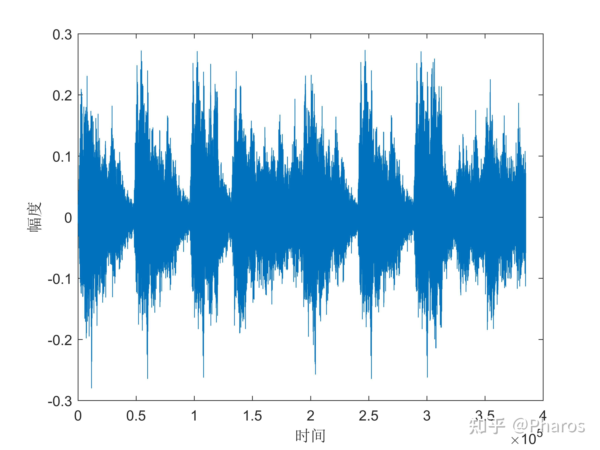
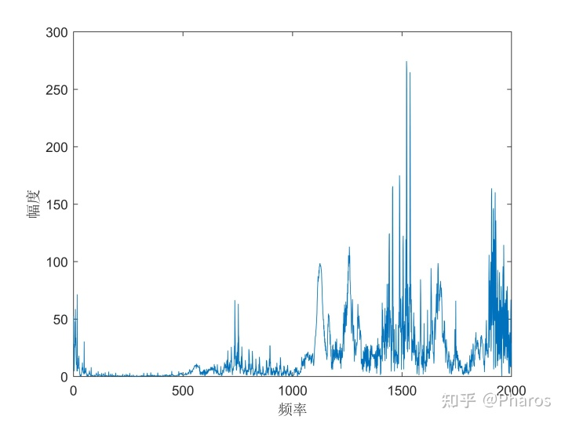
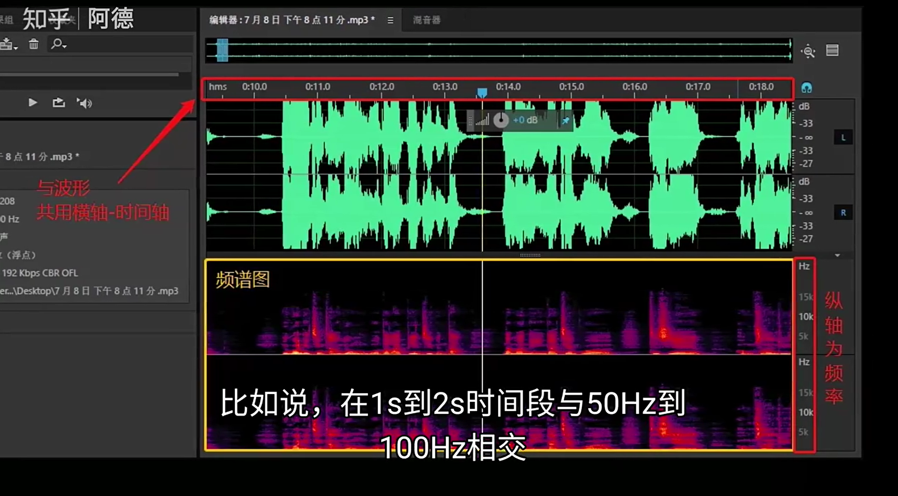
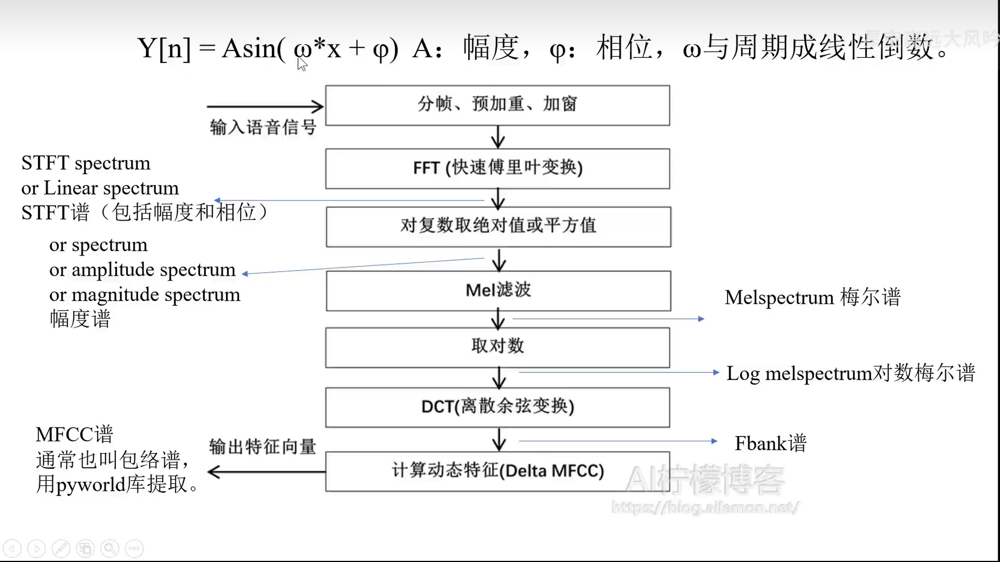
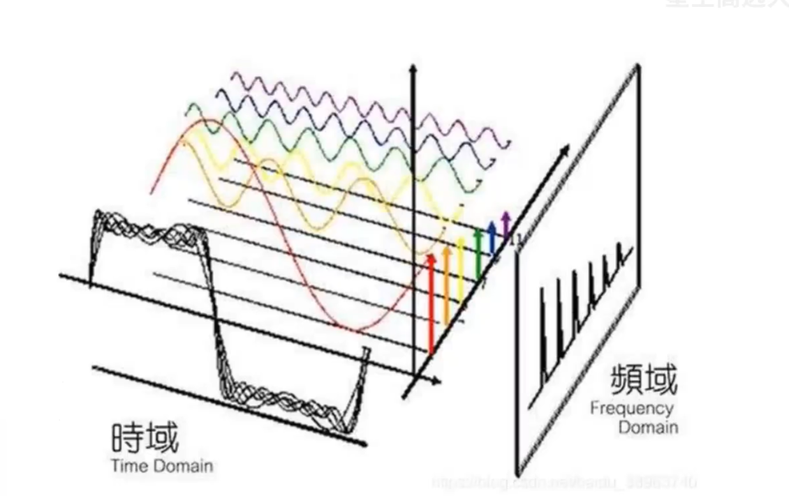

# 第一部分.语音信号处理

### 1.1语音信号和频率
`声音即为空气分子不断的振动和传播。语音信号是从传感器中按照一个离散的时间间隔进行采样，得到的一维信号。有两个关键因素，时间和振幅`  
`频率是每秒钟的周期性变动的次数的计量，可以简单理解为一秒钟振动多少次`  
`语音信号是一个一维向量，信号长度=采样时间(t)*采样率(频率hz)     公式一（1）`
### 1.2波形图和振动图像
`我们常常用波形图来表示一段声音信号，波形图其实是当前时刻每一个质点的位置（一个图里面有很多的质点），横纵坐标都是长度单位。注意波形图和振动图像的区别，振动图像是一个质点具体的运动情况，横坐标是时间，纵坐标是振幅。这里提一下还可以从各种角度（时间/频率）来直接看语音信号，很多时候就是直接将波形图理解为横坐标为时间，纵坐标为振幅`

### 1.3频谱图（也可以成为幅度谱）
`把一维的语音信号经过各种不同的处理，就可以得到频谱图，频谱图的横坐标是时间，纵坐标是频率，从下到上，频率由低到高，颜色深浅会表示幅度的强弱，简单来看，某区域的颜色越亮，则说明该区域的声音越多，如下图所示的下半部分的图`  
`整张图可以表示为语音信号的各个频率分量随着时间变化，其幅度的强弱的变化`

### 1.4声码器
`将频谱图转化成波形的系统称之为声码器`
### 1.5语音信号处理的具体过程
##### 1.5.1总体框架图（important），每一步都得会，包括英文，得到什么谱

##### 1.5.2我们语音主要用到的是幅度谱(amplitude spectrum)和梅尔谱(对数梅尔谱，频率成对数增加，前面幅度谱频率是线性增加)。而MFCC谱和Fbank谱现在用的比较少。
##### 1.5.3短时傅里叶谱的提取，分帧和加窗
`首先我们得目的是将一维向量转化为二维的矩阵M，我们会将语音转化成各个成分的信息`

`关键点1：如上图所示，这个红橙黄绿青的的图的横坐标是频率，那么我们的矩阵M的行数就是彩色线的根数，即有多少种不同的频率，具体怎么求，是傅里叶变化的数学原理，代码里面会有一个超参数n_fft（大部分情况下我们会设置幅度谱的n_fft为1024）。公式是，行数=n_fft//2+1   公式二（2）`  
`关键点2：这个颜色的含义是多少，即红色代表了多少频率，是50hz还是100hz，且红色和橙色之间的距离是多少。具体怎么求，首先为了信号丰富性，对于一维的语音信号，我们会有一个滑动窗口的思想，那么我们会知道窗口的距离长度这个超参数，那么根据公式一，我们已知采样率和距离长度，则可以知道窗口的采样时间大小，那么采样时间大小的倒数即为频率的间隔，例如结果为50hz，则红线是50hz，橙线是100hz，黄线是150hz等等一直到行数*50hz`  
`关键点2：矩阵M的列数是多少，根据关键点2中滑动窗口的思想，我们除了得知道，窗口的距离宽度大小，还是知道每次窗口移动的距离，即帧移。那么公式为(注意要不要加一取决于取证)，列数=一维向量信号长度/帧移+1  公式三(3)可以将列数理解为最终得到了多少组窗口`  
`综上，我们得知道三个超参数分别是n_fft，窗口长度，帧移距离，可以通过改变语音信号时间长度或者帧移距离来控制列数`
### 1.6

